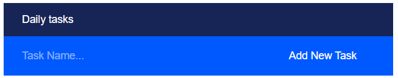
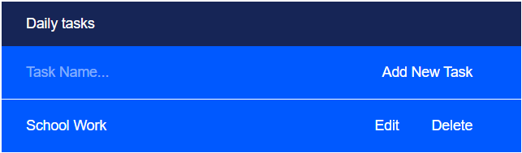
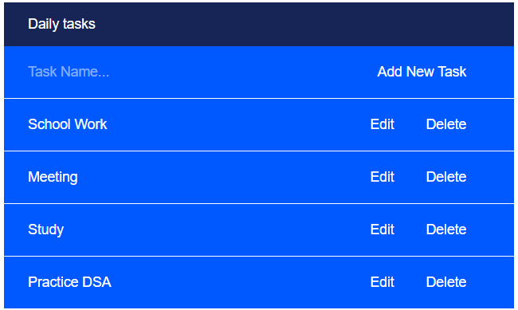
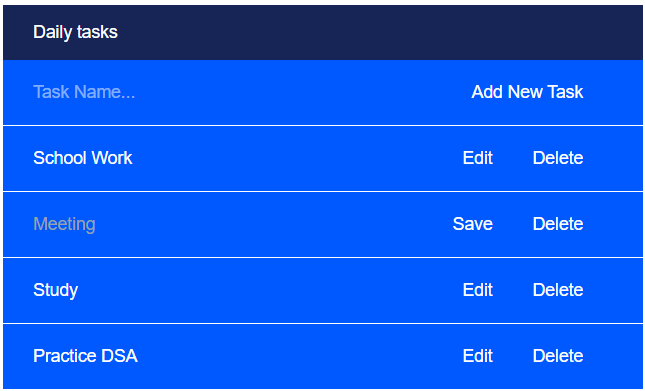
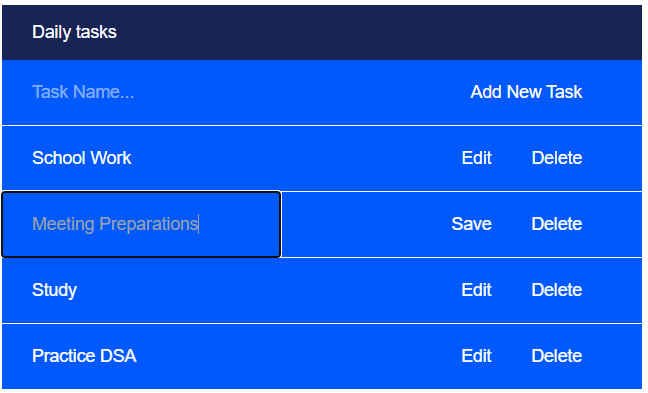
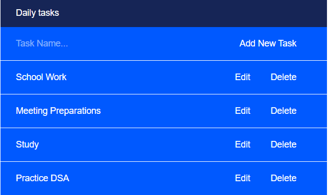
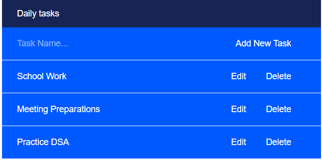
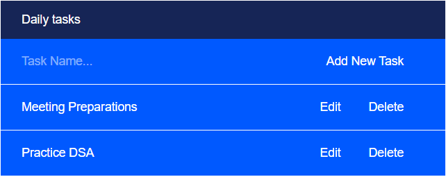

# A2SV WEB TRACK - To-Do List With ReactJS📝

Let's learn ReactJS. This is the first step to learning this awesome JavaScript framework.

## Introduction

This is an extension to the to-do-ts task.
In this task a simple To-Do list is created. It implements 3 Buttons ; Add, Edit and Delete.

## Learning Objectives :bookmark_tabs:

* How does ReactJS Work
* What are ReactJS hooks and how do they work
* What are ReactJS rooters
* How to style a ReactJS app

## Tasks :heavy_check_mark:

0. Create text input.
1. Implement Add button.
2. Implement Remove button.
3. Implement Edit Button.
4. Implement Edit functionality.
5. Input error handling.

## Results :chart_with_upwards_trend:

| Filename |
| ------ |
| [main](https://github.com/omphilejmatsobe/todo-reactjs/tree/main/todo-app/src)|
| [components](https://github.com/omphilejmatsobe/todo-reactjs/tree/main/todo-app/src/ui)|

## ScreenShots :bookmark_tabs:

## Add:

## Edit:

## Delete:

